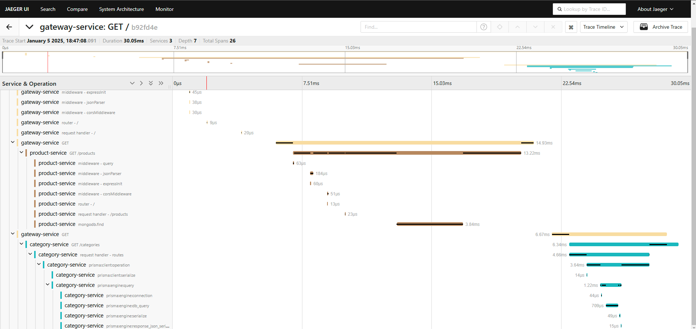

# Otel Tracing

<p>
  
   
  
  
</p>

Tracing distribuido com OpenTelemetry e Jaegger



## start guide

### Docker

```bash 
docker compose up
```

<br>

---

Desenvolvido Por [Alessandro Massarotti Jr](https://github.com/alessandro-massarotti-jr) 🤖
